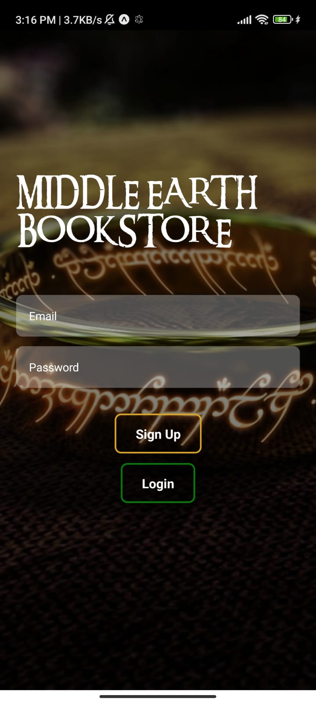
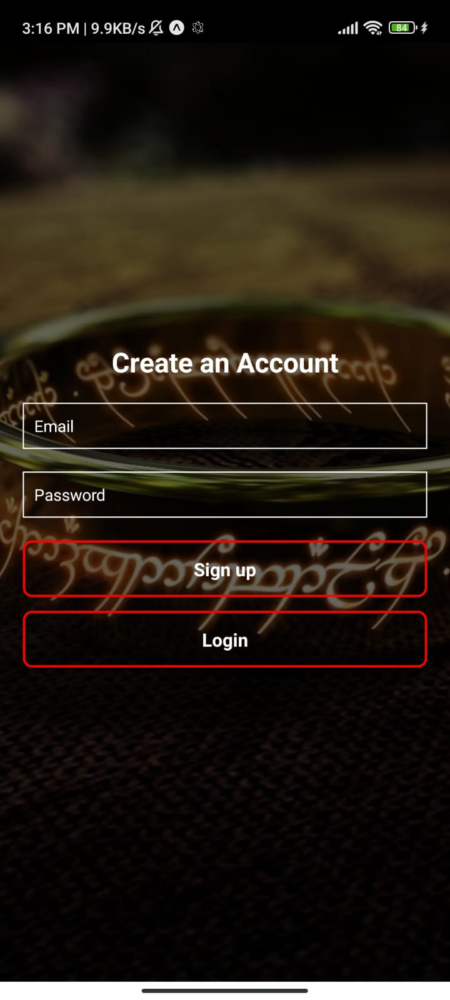
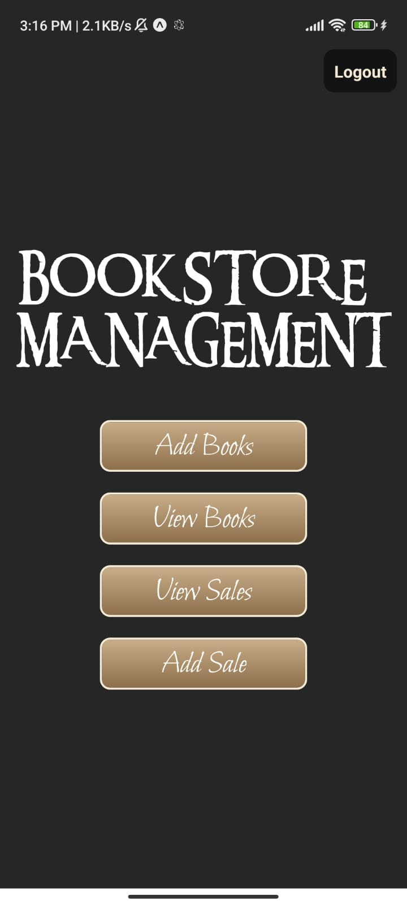
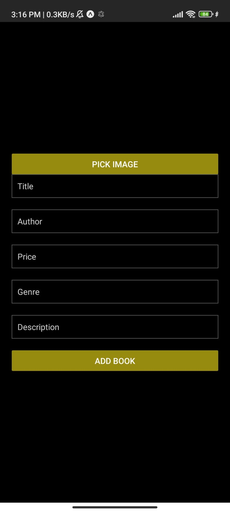
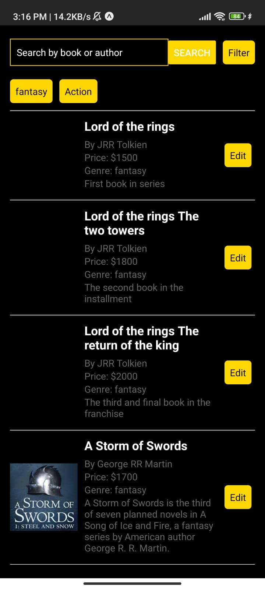
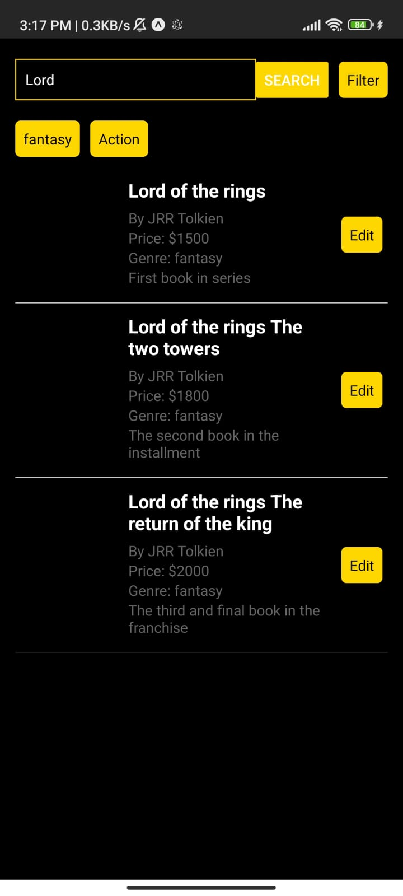
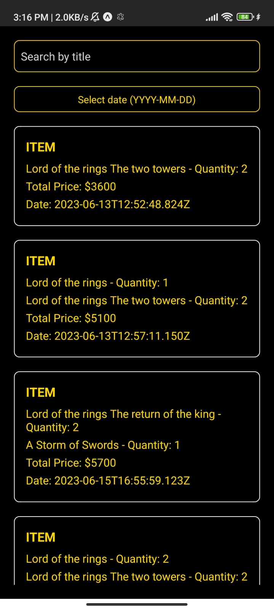
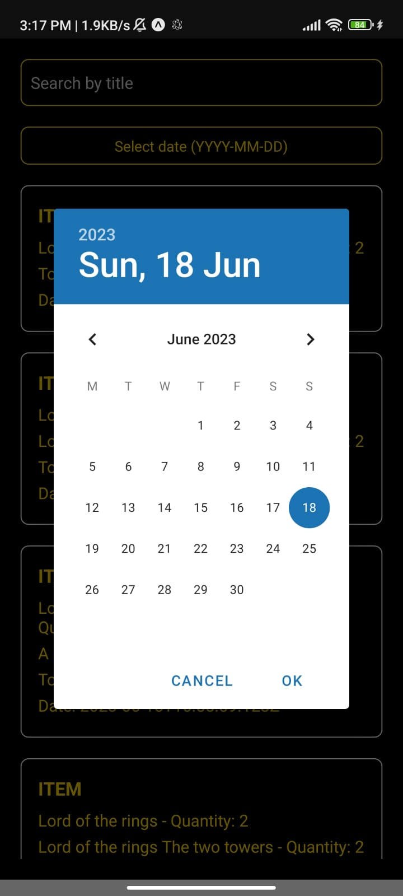

# Middle-Earth-Book-Shop

Welcome to the Middle Earth Book Shop! This project is a book management system that allows users to add, view, and manage books and sales in a bookstore.

## Table of Contents

- [Project Description](#project-description)
- [Features](#features)
- [Installation](#installation)
- [Usage](#usage)
- [Technologies Used](#technologies-used)
- [Contributing](#contributing)
- [ScreenShots](#screenshots)

## Project Description

The Book Shop Project is designed to simplify the management of books and sales in a bookstore. It provides an intuitive interface for adding new books, viewing existing books, and managing sales records. This project aims to streamline book inventory management and improve sales tracking efficiency.

## Features

- Add new books to the inventory
- View and search for books by title and category
- Track sales records and view sales history
- Add new sales records to track book sales
- User authentication and authorization
- Responsive and user-friendly interface

## Installation

To run the Middle Earth BookShop locally, follow these steps:

1. Clone the repository: `git clone https://github.com/your-username/book-shop-project.git`
2. Install dependencies: `npm install`
3. Configure environment variables (firebase config and metro.config)
4. Start the development server: `npm start`

## Usage

Once the project is up and running, open your expo go app and scan the QR code. From there, you can register an account, log in, and start managing books and sales.

## Technologies Used

- React Native: Framework for building cross-platform mobile applications
- Firebase: Backend as a Service (BaaS) for user authentication and data storage
- Expo: Framework for developing React Native applications
- HTML/CSS: Markup and styling for the user interface
- JavaScript: Programming language for web development

## Contributing

Contributions are welcome! If you have any suggestions, bug reports, or feature requests, please open an issue or submit a pull request. For major changes, please discuss them with the project maintainers.

## ScreenShots
### Login Page

### Signup Page

### Home Page

### Add Book

### Edit Book

### View Books

### Book Search

### Add Sale

### View Sale

### View Sale filter

